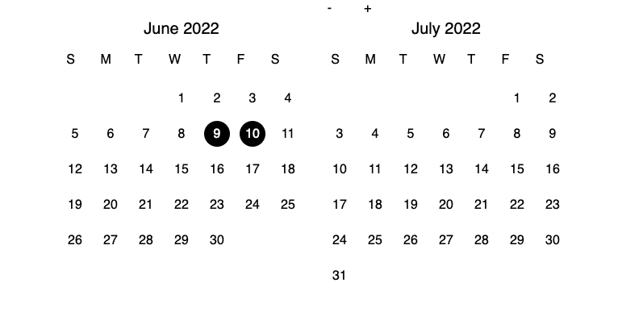

# react-booking-calendar

## What is it?
  This is an open source react based booking calendar inspired by airbnb's booking calendar. This project was built for use in a larger react project, with basic tailwind css styling. Functionality is the priority, so you'll likely need to familiarize yourself with tailwind in order to get it looking the way you need it to.

  

  ## [LIVE DEMO](https://react-booking-cal.herokuapp.com)
***

## Want to use it?

Feel free to clone this repo and copy/paste the components into your react project!

Make sure you are using [tailwindcss](https://tailwindcss.com/docs/installation), otherwise you'll have to figure out the styling on your own!

```
npm install -D tailwindcss
npx tailwindcss init
```
Also, this relies heavily on the datefns library. Make sure to get it! 

```
npm install date-fns --save
```